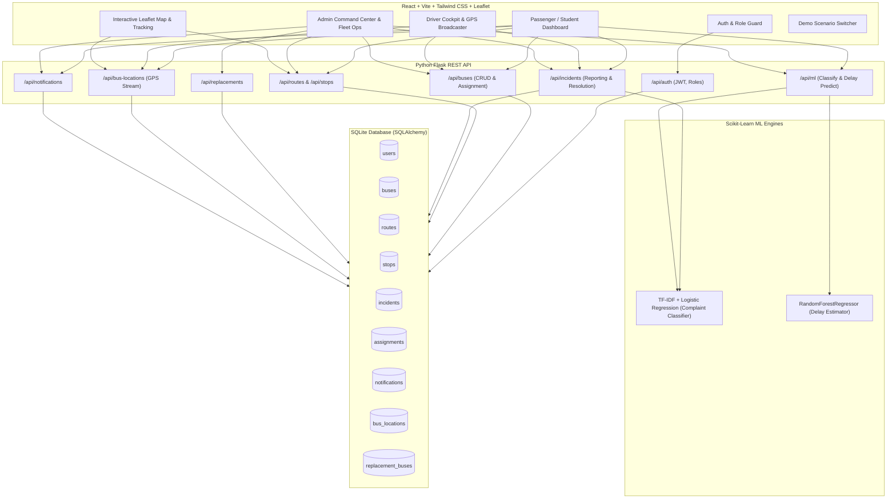

# 🚍 SmartTransit — Real-Time Public Transport Tracking & Incident Management System

> **A centralized, intelligent transit support platform designed for colleges and small cities.**  
> Real-time OpenStreetMap/Leaflet bus tracking, automated AI complaint triage, live delay predictions, driver GPS telemetry simulator, and rapid replacement bus dispatching.

---

## 📌 Problem Statement

Small-city and college transportation systems frequently suffer from lack of visibility during operational anomalies:
- Bus breakdowns leave students stranded without status updates.
- Delay causes are unknown to waiting passengers.
- Transport admins struggle to coordinate mechanics, standby buses, and student notifications simultaneously.
- Traditional complaint systems lack automated triage and prioritization.

### 💡 The SmartTransit Solution
SmartTransit connects **Students/Passengers**, **Drivers/Staff**, and **Administrators** into a unified real-time ecosystem powered by lightweight AI/ML models:
1. **Real-Time Interactive Tracking**: Live vehicle positions on OpenStreetMap with stop arrival checklists and route paths.
2. **AI Complaint Classifier**: Scikit-Learn TF-IDF + Logistic Regression model classifying student complaints into categories (*Breakdown, Delay, Route Issue, Overcrowding, Driver Issue, Missed Stop*) and severity priorities (*High, Medium, Low*).
3. **AI Delay Prediction Sandbox**: Random Forest Regressor predicting travel delays based on route distance, stop counts, rush hours, weather, and congestion.
4. **Replacement Bus Dispatch Wizard**: 1-click admin workflow to substitute broken buses with standby vehicles and broadcast live alerts to all affected students.
5. **Driver GPS Cockpit**: Live trip broadcaster with stop sequence advancing and 1-click breakdown triggers.

---

## 🏛️ System Architecture



---

## 👥 Role Features

### 🎓 1. Student / Passenger
- **Live Bus Tracking**: Track all active buses and route waypoints with custom vehicle markers and live speed.
- **Route Explorer**: View all 4 feeder routes, stop sequences, and travel duration estimates.
- **AI-Powered Incident Reporting**: Submit plain-English complaints with **real-time AI category & priority preview**.
- **Incident History**: Follow the real-time status of reported issues (Open $\rightarrow$ In Progress $\rightarrow$ Resolved).
- **Live Broadcasts & Notifications**: Receive alerts for delays, breakdowns, and replacement bus assignments.

### 🚌 2. Driver / Transport Staff
- **Driver Cockpit**: View assigned vehicle (e.g. `Bus B12`), route, and telemetry.
- **GPS Trip Simulator**: Start trips, auto-step through route stops, or advance coordinates in real-time.
- **1-Click Emergency Reporting**: Instant buttons to report engine breakdown or severe traffic delay.
- **Assigned Maintenance Tasks**: View repair and maintenance tickets assigned by admin with completion toggles.

### 🛡️ 3. Transport Administrator
- **Command Center Dashboard**: Executive KPIs (Total Fleet, Active, Delayed, Breakdowns, Replacements, Open Incidents).
- **Fleet Management**: Add, edit, assign drivers/routes, and change vehicle status (`Active`, `Delayed`, `Breakdown`, `Replacement`, `Out of Service`).
- **Route & Stop Sequencer**: Create and modify routes with GPS coordinates and stop orders.
- **Incident Command Center**: Triage incoming incidents with AI tags, assign transport staff, and dispatch replacement buses.
- **Replacement Bus Operations**: Track all active substitutions and return vehicles to standby duty upon repair.
- **AI Delay Predictor Sandbox**: Interactive parameter sandbox running the Random Forest delay prediction model.
- **Fleet Analytics**: Incident categories distribution and priority severity breakdown charts.

---

## 🤖 AIML Implementation

### 1. Complaint Classification
- **Architecture**: `Text Preprocessing` $\rightarrow$ `TF-IDF Vectorizer (1-2 ngrams)` $\rightarrow$ `Logistic Regression`
- **Output**: Category (*Breakdown, Delay, Overcrowding, Route Issue, Missed Stop, Driver Issue, Other*) + Priority (*High, Medium, Low*) + Confidence score.
- **Storage**: Serialized with `Joblib` in `backend/ml/models/complaint_classifier.joblib`.

### 2. Delay Prediction
- **Architecture**: `RandomForestRegressor (100 estimators, max_depth=10)`
- **Features**: Route Distance (km), Stop Count, Hour of Day (Rush hour penalties), Day of Week, Congestion Level (1-4), Previous Delay Carry-over, Rainy Weather.
- **Output**: Expected delay in minutes.
- **Storage**: Serialized with `Joblib` in `backend/ml/models/delay_predictor.joblib`.

---

## 🚀 Quick Start Guide

### Prerequisites
- **Python 3.10+**
- **Node.js 18+** & **npm**

---

### Step 1: Backend Setup
Open a terminal in the project root:

```bash
cd backend
# 1. Install dependencies
pip install -r requirements.txt

# 2. Train ML models & seed sample database
python seed.py

# 3. Start Flask REST API server (Runs on port 5000)
python app.py
```

---

### Step 2: Frontend Setup
Open a second terminal in the project root:

```bash
cd frontend
# 1. Install dependencies
npm install

# 2. Start Vite development server (Runs on port 5173)
npm run dev
```

Open your browser at: **`http://localhost:5173`**

---

## 🔑 Demo Test Credentials

| Role | Email | Password | Pre-Assigned Entity |
| :--- | :--- | :--- | :--- |
| **Admin** | `admin@smarttransit.com` | `password123` | Full Fleet & Incident Command |
| **Driver (B12)** | `driver@smarttransit.com` | `password123` | Bus B12 / Route 4 |
| **Driver (B18)** | `driver2@smarttransit.com` | `password123` | Bus B18 / Standby Fleet |
| **Student** | `student@smarttransit.com` | `password123` | Passenger on Route 4 |

> 💡 **Tip**: The login page and top navbar include **1-Click Demo Buttons** to instantly log in as any persona without typing!

---

## 🎬 End-to-End Bus Breakdown Scenario Walkthrough

To experience the full integration in under 60 seconds:
1. Click the **"Interactive Demo Scenario"** button in the top navigation bar.
2. **Step 1 (Driver)**: Start trip on Bus `B12` (Route 4).
3. **Step 2 (Driver Issue + AI)**: Driver reports engine failure $\rightarrow$ AI models triage as **Breakdown** & **High Priority**.
4. **Step 3 (Admin Dispatch)**: Admin assigns mechanic Suresh Reddy and standby Bus `B18` as **Replacement**.
5. **Step 4 (Student Alert)**: System reassigns `B18` to Route 4 and broadcasts alert banner:
   *«⚠️ Bus B12 has broken down. Replacement bus B18 is now assigned to Route 4.»*
6. **Step 5 (Live Tracking)**: Switch to student view $\rightarrow$ Open **Live Bus Tracking** $\rightarrow$ See `B18` moving on Route 4!

---

## 📁 Project Structure

```
SmartTransit/
├── backend/
│   ├── app.py                     # Flask application factory & routes
│   ├── config.py                  # Database & JWT settings
│   ├── requirements.txt           # Python dependencies
│   ├── seed.py                    # Seeder & ML model initializer
│   ├── test_api.py                # Automated API test suite
│   ├── database/
│   │   └── database.db            # SQLite database
│   ├── models/
│   │   ├── __init__.py            # SQLAlchemy db instance
│   │   ├── user.py                # User & role model
│   │   ├── bus.py                 # Bus & GPS location model
│   │   ├── route.py               # Route & Stop model
│   │   ├── incident.py            # Incident, Assignment, Replacement models
│   │   └── notification.py        # Broadcast notification model
│   ├── routes/
│   │   ├── auth.py                # JWT registration & login
│   │   ├── buses.py               # Bus CRUD & assignments
│   │   ├── routes.py              # Route & stop APIs
│   │   ├── incidents.py           # Incident lifecycle & replacement
│   │   ├── tracking.py            # Live GPS broadcast & query
│   │   ├── notifications.py       # User alerts & announcements
│   │   ├── analytics.py           # Dashboard statistics
│   │   └── ml_routes.py           # Classification & Delay prediction endpoints
│   └── ml/
│       ├── train_models.py        # ML training script
│       ├── classifier.py          # Complaint classifier inference wrapper
│       ├── delay_predictor.py     # Delay regression inference wrapper
│       └── models/                # Serialized .joblib models
│
└── frontend/
    ├── package.json
    ├── vite.config.js
    ├── src/
    │   ├── App.jsx                # Router & role access control
    │   ├── main.jsx               # React entry
    │   ├── index.css              # Tailwind CSS & Leaflet theme
    │   ├── services/
    │   │   └── api.js             # Axios client with JWT interceptors
    │   ├── context/
    │   │   └── AuthContext.jsx    # Auth state & quick persona switcher
    │   ├── components/
    │   │   ├── Navbar.jsx         # Header, alerts popover, persona switch
    │   │   ├── Sidebar.jsx        # Role-based navigation
    │   │   ├── StatusBadge.jsx    # Transit status & priority badges
    │   │   ├── BusCard.jsx        # Vehicle summary card
    │   │   ├── IncidentCard.jsx   # Incident card with AI tags & actions
    │   │   ├── LeafletMap.jsx     # OpenStreetMap vehicle & route renderer
    │   │   └── DemoScenarioModal.jsx # 1-Click interactive scenario runner
    │   └── pages/
    │       ├── Login.jsx          # Login with 1-click persona quickfill
    │       ├── Register.jsx       # User registration
    │       ├── student/           # Dashboard, Tracking, Routes, Report, Incidents, Notifs
    │       ├── driver/            # Dashboard, TripControl, Report, Tasks
    │       └── admin/             # Dashboard, Buses, Routes, Incidents, Replacements, Staff, DelayPredictor, Analytics
```

---

## 🧪 Verification & Testing

To run the automated backend test suite:

```bash
cd backend
python test_api.py
```

Result:
```
Ran 7 tests in 2.856s
OK (100% Passed)
```

---

## 🏆 Summary of Completed Objectives
- ✅ Complete Role-Based Web App (Student, Driver, Admin)
- ✅ Real-Time Leaflet / OpenStreetMap Bus & Stop Tracking
- ✅ Simulated Driver GPS Telemetry Broadcaster
- ✅ Scikit-Learn TF-IDF + Logistic Regression Complaint Classifier
- ✅ Random Forest Transit Delay Prediction Engine
- ✅ Interactive Breakdown $\rightarrow$ AI Triage $\rightarrow$ Replacement Bus Workflow
- ✅ Broadcast Notifications & Status Badging
- ✅ Zero-configuration local execution with SQLite and seed data
